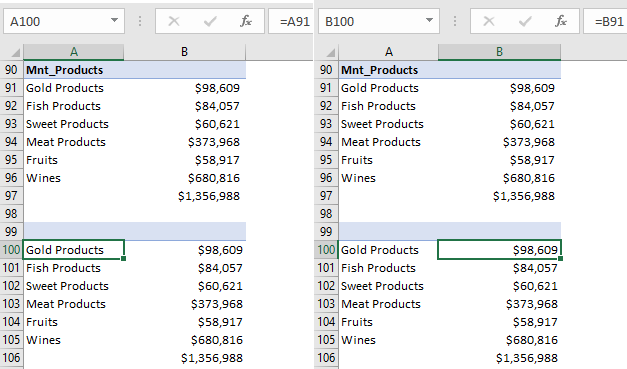

# Maven Marketing – Campaign Result Analysis
## Introduction
The dataset contains marketing campaign data of 2,240 customers of Maven Marketing, including customer profiles, product preferences, campaign successes/failures, and channel performance. My goal is to carry out a marketing analysis that will provide insight into the customer demographics and product performance across different campaign channels, to enable Maven marketing to make profitable data-driven decisions.

## About the Data
The dataset is a CSV file that contains one table, consisting of ** 2,240 rows and 28 columns**. The data was gotten from a file shared on [#LearnDataAnalyticswithTina](https://drive.google.com/drive/folders/18o4QrU4Ider8GT4Kx_YRLLfT2VwEBhyc) Timeline on Twitter

## Business Question
The following business questions have been presented to enable the team at Maven Marketing to understand the result of their previous marketing campaigns. My goal is to present answers to these questions and deliver valuable insights that will evoke business growth for Maven Marketing.
1.	What factors are significantly related to the number of web purchases? 
2.	Which marketing campaign was the most successful? 
3.	What does the average customer look like? 
4.	Which products are performing best? 
5.	Which channels are underperforming? 
 

## Microsoft Excel Skills/Concepts applied:
-	Data Cleaning
-	Excel Formulas (`Date`, `IFS`, `VLOOKUP`, etc.)
- Cell Referencing
-	Pivot Tables/Charts
-	Data Visualization

## Data Cleaning
The dataset was imported into Microsoft Excel Using the **"Get data"** option in the `data` tab. The original dataset contains ** 2,240 rows and 28 columns**. Here is how I cleaned the data:

-	The “remove duplicate” operation was applied in the “ID” Column, and there were no duplicates.
-	Column datatypes were validated appropriately – E.g. income column was formatted to have currency format.
-	To change the date column, `Year_Birth`, to the ‘date’ data type, a new column was created, and the formula below was used to fill the new column with the data that can be changed to the date data type from the `format tab`. This was done to retain the original values while representing them as dates.
```
=Date (Year, month, day) / =DATE(B2,1,1)
```
The cell reference ID, “B2” contains the year record in the original column. The formula converts the year in cell B2 to a date format by assuming the month and day as January 1st. The format was changed to ‘yyyy’ through custom format to have only the year part displayed. The rest of the rows were auto-filled by Excel accordingly.

 ## Data Discovery and Visualization in Power BI

### What factors are significantly related to the number of web purchases? 

A marketing campaign is mostly done to pull traffic to the Store’s website and other channels, which will translate to product purchases/sales thereby converting leads to customers. Hence, it is important to understand likely factors that affect web purchases. The first areas of interest I considered for evaluation is Age and Education. The data had no column for age, so a new column for Age as of 2014, which is the last year of the data record was created using the formula below:
```
= (2014 – B2)
```
The formula subtracts the year in cell B2 from 2014. The rest of the rows were auto-filled by excel accordingly. The column was then changed to `Number` format. Additionally, another new column for Age group was also created using the formula below:
```
=IFS(D2<=30,"Adolescent",D2<=40,"Adult",D2<=55,"Middle-Age",D2>55,"Senior")
```
The formula groups customers based on their ages in Column D: 30years & below – Adolescents, 40years & below – Adult, 55years & below – Middle-Age, and those above 55years as “Seniors”. The rest of the rows were auto-filled by Excel accordingly.

 
Having, created the column for Age and Age groups, A pivot table and pivot chart was created to check for web purchases by age group and education, as shown below.


From the Visual above, we see that the highest number of web purchases were made by the Middle-Aged in the graduation level of education. This group of people, who are between ages 41 and 54 are likely married in most places. Well, don’t take my word for it – let the data speak, as we move on to consider web purchases by Marital Status. A Pivot table and Chart was also created to check for that.


 
Voila! The married category made the highest web purchases. 😄😄😄

Having observed that **being married and middle-aged** are factors that relate to high web purchases, it will be important to find out the variation by country. A pivot table was created to get the data summary for each country. However, Microsoft Excel is unable to create certain visuals, such as a filled map visual, with data inside a Pivot Table. Hence, to use the appropriate visual, the data was copied outside the Pivot Table. This was done by sorting the data alphabetically, then in a new cell, replicating the country and web purchase columns with the formula as shown below:
```
=A50
&
 =VLOOKUP(D50,$A$50:$B$57,2)
```

 
The process was used to also ensure that the visual is interactive on the dashboard at the end. The map visual was then created from the `Insert tab`. The resulting Pivot and visual, as shown below, shows that **Spain** had the highest number of web purchases, while Mexico had the least record of web purchases.


### Which marketing campaign was the most successful? 
We have now seen the web purchases variation across various categories, but how did the marketing campaigns fare at each stage – was there a high acceptance at the first campaign? or after subsequent campaigns? A Pivot table and Chart was created to evaluate this, as shown below.


From the Pivot Table and Chart/Visual above, we see that **Campaign 4** was the most successful marketing campaign. 

### What does the average customer look like? 
There’s a seeming sinusoidal pattern in the acceptance of the campaigns, from Campaign 1 to 5, with the peak being at Campaign 4. Hence, it will be important to understand who the average Maven customer is, in order to tailor marketing campaign strategies.


From our resulting Pivot, we see that the Average Maven Customer is a Married, Middle-Aged individual with over $50,000 as Income and has at least 1 teenage child.

### Which products are performing best? 
Now that we have a mental picture of the average Maven customer, let’s understand their preferences in terms of product purchase. A pivot table was created to get the data summary for the product category. However, MS Excel is unable to create certain visuals, such as a Treemap visual, with data inside a Pivot Table. Hence, to use the appropriate visual, the data was copied outside the Pivot Table using cell referencing [shown below] in a new cell and filling down the columns accordingly
```
=A91
&
 =B91
```

 

The process was used to also ensure that the visual is interactive on the dashboard. The Treemap visual was then created from the `Insert tab`. The resulting Pivot and visual, as shown below, shows that the best-performing product is **Wines**, with over $600,000 spent on them in the last two years, followed by Meat Products, while the least amount was spent on Fruits. Perhaps, the Customers of Maven marketing are mainly non-vegetarians🤔. Additional information from the customers will be needed to ascertain this as a fact or an occurrence of chance.


### Which channels are underperforming? 
Finally, we'd love to understand the performance of the various channels to help identify levels of Improvement each may require. By creating a pivot table and chart, we find that the **Catalog** sales channel is the least-performing channel, accounting for only 21% of the total purchases. This channel requires attention to enhance Improvement.


## Dashboard
The interactive dashboard contains a worksheet overview of the analysis visuals. It was created to provide insights and dynamic answers to the business questions. You can interact with the dashboard here. 


## Key Insights:

-	Customers at the Graduation education level accounted for the highest number of web purchases across all age groups.
-	 Customers in Spain and the married group made the highest web purchases.
-	**Campaign 2** had the least acceptance rate, indicative of low Customer engagement & response.
-	The rise and fall pattern in the campaign performance is indicative of reduced effort after a seemingly successful one.  
-	The Average Maven Customer is a Married, Middle-Aged individual earning over $50,000 as Income and has at least 1 teenage child.
-	**Wines** & **Meat products** are the best-selling products from the campaign.
-	Based on the number of purchases across the channels, the **Catalog** sales channel is underperforming and requires attention. 
-	The high rate of Store purchases indicates that Maven has more walk-in Customers than others.

## Recommendations:
-	To address sinusoidal patterns in campaign outcomes, the team needs to develop & sustain consistent marketing strategies that drive Customer engagement with a goal to achieve better performance than previous.

-	While wines and meat products have been successful in the campaign, the team should conduct market research to identify other high-demand products, get customer feedback to stay updated with evolving trends/preferences, and adjust the product mix accordingly to enhance sales of other product categories.


-	To improve sales from the Catalog channel, the team should consider enhancing the design and content of the catalog, making it visually appealing and engaging. Special discounts can be attached to orders from the catalog too, to drive increased purchases from the channel.

-	As most customers prefer in-person purchases, customer service and experience should be enhanced continuously in the stores.

